# 多模态机器学习实验2 - 本地AI智能文献与图像管理助手

## 1. 项目简介与核心功能
本项目实现一个本地论文库的管理与多模态检索工具，统一通过 `main.py` 提供命令行入口，支持：

- 对单篇 / 批量 PDF 论文附加主题标签（topics），并根据主题将论文加入本地论文库中
- 论文语义搜索，实现 **Text → Paper** 的语义检索
- 以文搜图，实现 **Text → Image** 的跨模态检索

适用场景：本地论文管理、按主题归档、快速定位“相关论文/图片”。

## 2. 项目结构
```text
.
├── main.py                     # 主文件
├── papers/                     # 本地论文库（PDF）
├── images/                     # 本地图片库
├── embeddings/                 # 向量库
│   ├── papers_chroma/          # 论文文本向量库（ChromaDB）
│   └── images_chroma/          # 图片向量库（ChromaDB）
├── README.md
└── environment.yml             # Conda 环境配置
```

## 3. 环境配置与依赖安装
Python 版本推荐：**Python 3.8 +**

在项目根目录执行：
```bash
conda env create -f environment.yml
```

## 4. 使用说明
### 4.1 将单篇文献加入本地论文库
```bash
python main.py add_paper <path> --topics "Topic1,Topic2"
```
说明：
- `<path>`：PDF 文件路径；
- `--topics`：以逗号分隔的主题标签字符串。

### 4.2 将批量文献加入本地论文库
```bash
python main.py organize_papers --root-dir <path> --topics "Topic1,Topic2"
```
说明：
- `<path>`：需要批量处理的 PDF 文件夹。

### 4.3 在本地论文库中搜索文献
```bash
python main.py search_paper <query>
```
说明：
- `<query>`：自然语言提问，如`"What is diffusion model"`。

### 4.4 在本地图片库中搜索图片
```bash
python main.py search_image <query>
```
说明：
- `<query>`：自然语言提问，如`"sunset over the sea"`。

## 5. 技术选型说明
- **PDF 解析与图片抽取：PyMuPDF（fitz）**
  - 用途：从 PDF 中提取文本内容
  - 优点：速度快、对 PDF 支持成熟

- **文本向量：Sentence-Transformers**
  - 用途：对论文文本（或摘要/分段文本）生成语义向量，用于 **Text → Paper** 检索
  - 模型：`sentence-transformers/all-MiniLM-L6-v2`（轻量、效果稳定，适合本地运行）

- **跨模态向量：CLIP**
  - 用途：将文本与图片编码到同一嵌入空间，用于 **Text → Image** 检索
  - 模型：`openai/clip-vit-base-patch32`

- **向量数据库：ChromaDB**
  - 用途：存储向量与元数据，支持 Top-K 相似度查询
  - 设计：论文文本与论文图片分别存入不同 collection，便于独立检索与增量更新

## 6. 演示
### (1) 添加单篇论文
事先在`papers/pending_files`文件夹下导入后续需要用到的论文 PDF 文件，如下图：

<p align="center">
  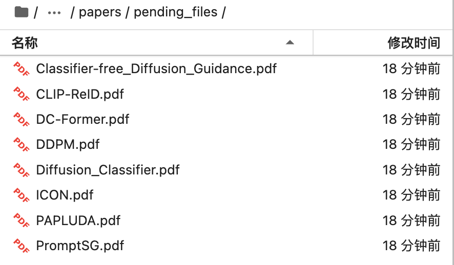
</p>

在执行指令前，`papers`文件夹内容如下：（`pending_files_副本`是一个为了方便还原论文 PDF 文件的副本文件夹）

<p align="center">
  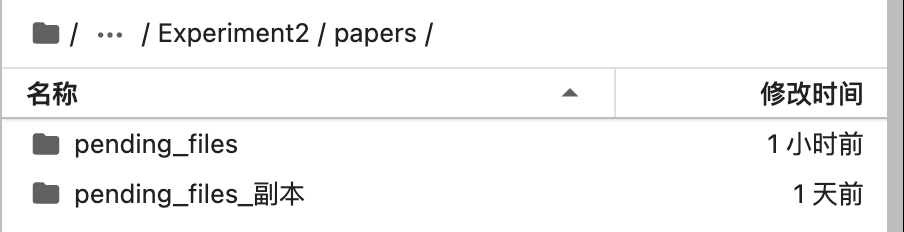
</p>

执行指令：
```bash
python main.py add_paper /root/autodl-tmp/Experiment2/papers/pending_files/CLIP-ReID.pdf --topics "ReID,UDA,Diffusion Model"
```

<p align="center">
  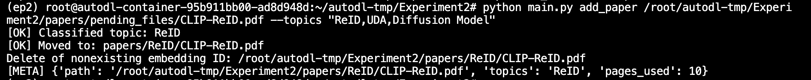
</p>

此时`pending_files`文件夹中的`CLIP-ReID.pdf`已消失：

<p align="center">
  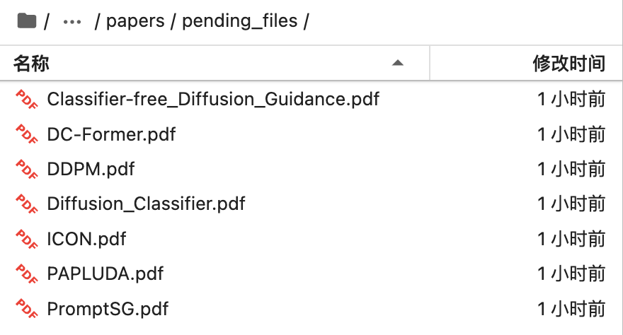
</p>

`papers`下新增新的主题文件夹`ReID`，`CLIP-ReID.pdf`文件已被移动到此处：
<p align="center">
  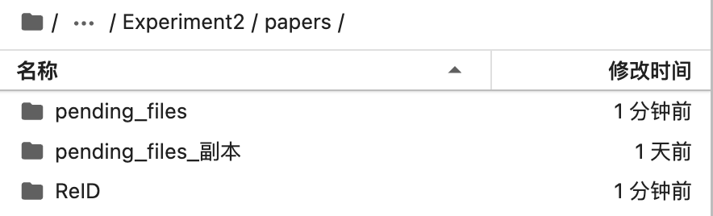
</p>
<p align="center">
  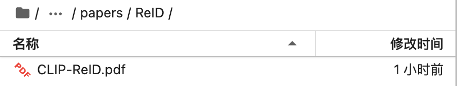
</p>

### (2) 批量添加论文
执行指令：
```bash
python main.py organize_papers --root-dir /root/autodl-tmp/Experiment2/papers/pending_files --topics "ReID,UDA,Diffusion Model"
```
<p align="center">
  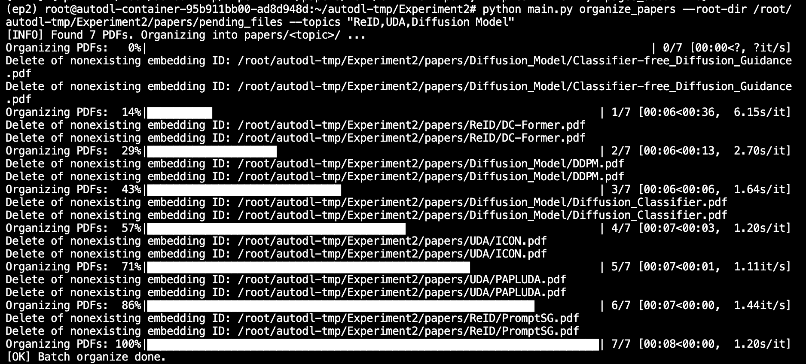
</p>

此时`pending_files`文件夹中的所有 PDF 文件均已消失：
<p align="center">
  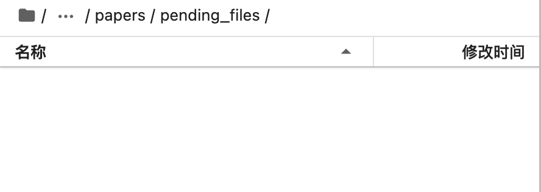
</p>

`papers`下新增新的主题文件夹`Diffusion_Model`和`UDA`，所有 PDF 文件已根据分类被移动到相应的文件夹中（所有论文分类正确）：
<p align="center">
  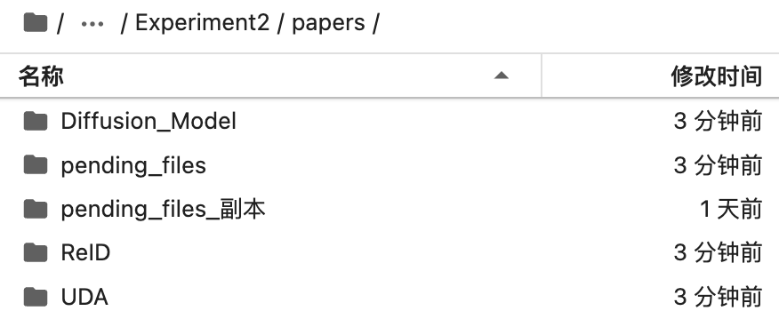
</p>
<p align="center">
  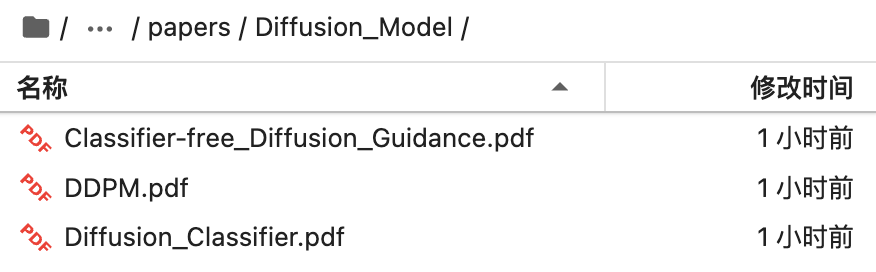
</p>
<p align="center">
  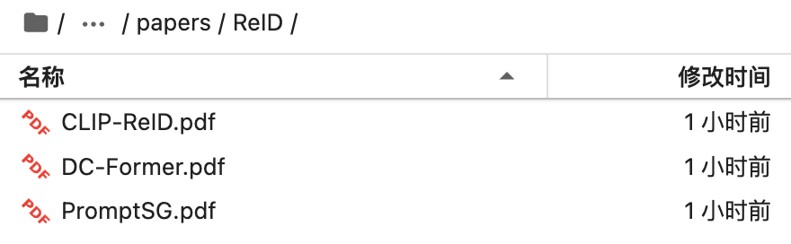
</p>
<p align="center">
  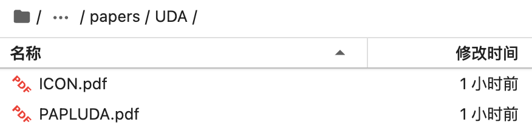
</p>

### (3) 语义搜索
执行指令：

```bash
python main.py search_paper "How to use CLIP in the ReID task"
```

此时返回的 top5 相似文件如下，其中 CLIP-ReID 和 PromptSG 是两个实现了 ReID 和 CLIP 结合的方法：

<p align="center">
  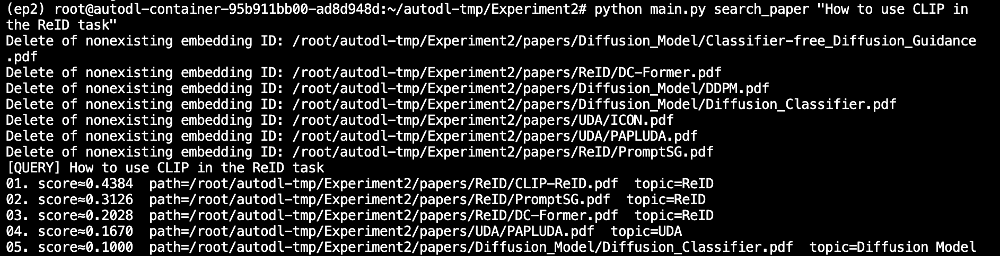
</p>

执行指令：

```bash
python main.py search_paper "What is Diffusion Model"
```
此时返回的 top5 相似文件如下，相似度排名前三的论文都属于 `Diffusion Model` topic：

<p align="center">
  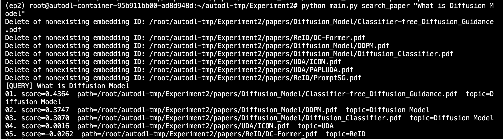
</p>

### (4) 以文搜图
本地图库`images`内容如下：
<p align="center">
  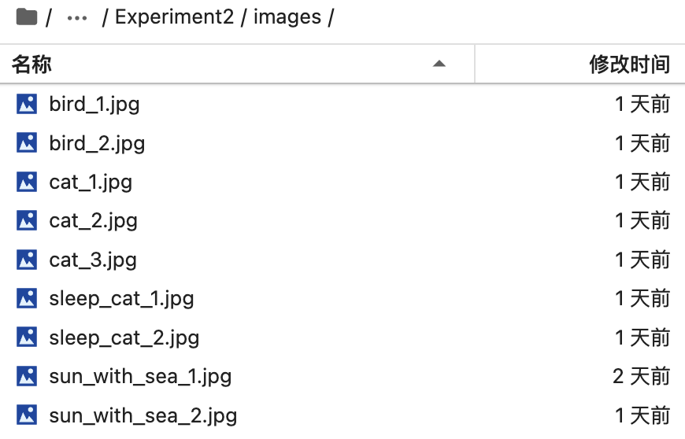
</p>

执行指令：

```bash
python main.py search_image "a sleeping kitten with its eyes closed"
```
此时返回的 top5 相似图像如下，相似度排名前二的图像都属于都是睡着的猫：
<p align="center">
  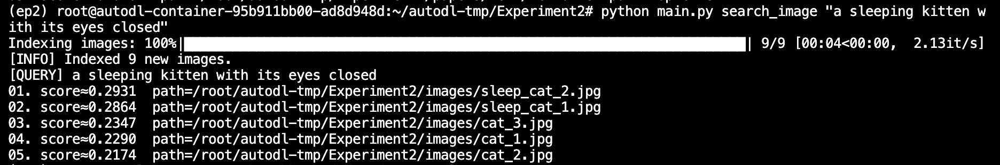
</p>


